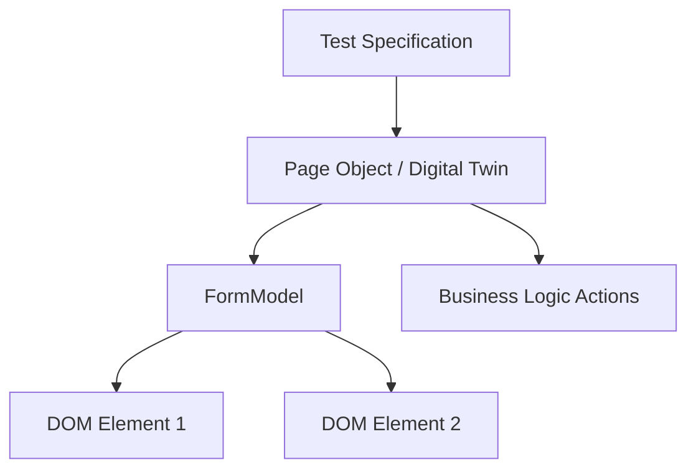
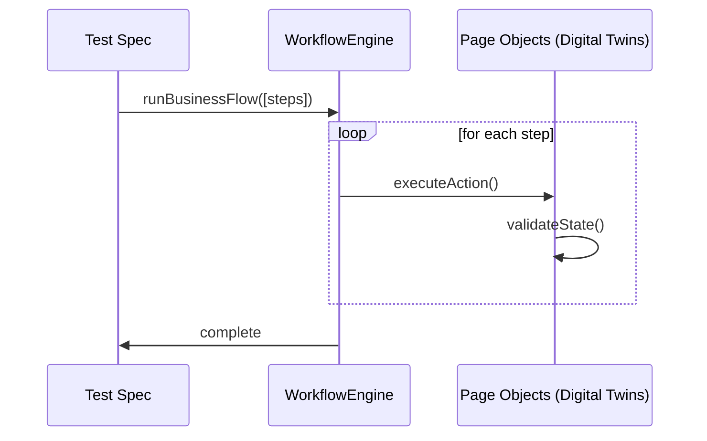

# Playwright Pro: Digital Twin Architecture

This framework implements a modern, model-based testing approach inspired by **Boozang**, designed for high coverage and low maintenance.

## Overview

### The Why
Modern web applications are complex and change rapidly. Traditional script-based testing is brittle and expensive to maintain. We need a framework that is resilient to UI changes and focuses on business value.

### The What
A Playwright-based framework that uses:
- **Digital Twins**: Decoupled models of the UI.
- **Workflow Engine**: Business-centric test orchestration.
- **Hybrid Execution**: Unified UI and API testing.

### The How
By mapping UI components to `FormModel` instances and chaining them in logical business flows, we ensure that tests are easy to write, read, and maintain.

## Core Concepts

### 1. Digital Twin (Model-Based Testing)
We treat the application as a set of models rather than just scripts. Every form and entity is mapped once in a `FormModel` and reused across multiple test scenarios.

### 2. Workflow Engine
Business flows are orchestrated using a `WorkflowEngine` that chains high-level logical nodes. This separates "What to test" from "How to interact".

### 3. LoginIfNeeded & Session Sync
To optimize execution, we use a `loginIfNeeded` strategy. Furthermore, we synchronize UI and API sessions by extracting the `jwtToken` from `localStorage` after a UI login, ensuring parity across all test actions.

### 4. Hybrid UI/API Workflows
The framework supports "Mixed Mode" testing. You can use API shortcuts for fast data setup and immediately transition to UI verification or interaction within the same test context.

### 5. Dynamic Data Generation
Ensures test uniqueness across parallel runs using the `DataGenerator` utility. It handles unique hashes and pattern-based data (e.g., `USER-####`).

### 6. TempDB (In-Memory Data Factory)
The `TempDB` singleton allows tests to share data within a single run. For example, a `Comment` test can reuse an `Article` created by a previous test to verify interactions without redundant setup.

> [!WARNING]
> **Parallel Workers Limitation**: Because `TempDB` is an in-memory singleton, it is worker-scoped. Tests that rely on sharing data through `TempDB` must run in the same worker process (using `--workers=1`). For true parallel execution across workers, consider using a persistent data store or file-based cache.

## Visual Concepts

### Digital Twin Architecture


### Workflow Execution


## Directory Map

| Directory | Purpose | Git Status |
| :--- | :--- | :--- |
| **`.agent/`** | AI agent configuration, workflows, and project context. | **Ignored** |
| **`.env`** | Local secrets and config (credentials, API tokens). | **Ignored** |
| **`.github/`** | GitHub Actions workflows and CI configurations. | Tracked |
| **`.tr/`** | **Ticket Resources**: Local cached insights from Jira/Azure. | **Ignored** |
| **`docs/`** | Long-form documentation and architectural decision logs. | Tracked |
| **`fixtures/`** | Playwright fixtures for data-injection and POM instantiation. | Tracked |
| **`pages/`** | **Digital Twins**: Page Objects containing the `FormModel` maps. | Tracked |
| **`playwright-report/`** | HTML reports generated after a test run. | **Ignored** |
| **`scripts/`** | Operational scripts (e.g., syncing data, cleaning envs). | Tracked |
| **`test-results/`** | Metadata and media (videos/traces) from failed runs. | **Ignored** |
| **`tests/`** | **Primary Test Suite**: Run by default by Playwright. | Tracked |
| **`tests-cleanup/`** | **Maintenance Tests**: Run using `TEST_MODE=cleanup`. | Tracked |
| **`types/`** | Unified TypeScript interfaces for Payload and Response data. | Tracked |
| **`utils/`** | Shared engines: `WorkflowEngine`, `DataGenerator`, `FormModel`. | Tracked |

## Scripts & Operations

### CI/CD Pipeline
The framework uses a structured pipeline with project dependencies:
- **`init`**: Environment setup and cleanup.
- **`smoke`**: Fast, critical-path tests (tagged `@smoke`).
- **`regression`**: Full-suite tests (tagged `@regression`).

```bash
npm run pipeline            # Run the full pipeline (Init -> Smoke -> Regression)
npm run pipeline:init       # Run only Init/Cleanup phase
npm run pipeline:smoke      # Run Init + Smoke tests
npm run pipeline:regression # Run the full sequence
```

### Ticket Integration
Sync bug reports from systems like Azure DevOps into the framework for unified insights.
```bash
npm run ticket:sync
```
*Note: Requires `AZURE_TOKEN`, `AZURE_ORG`, and `AZURE_PROJECT` in `.env`.*

## Getting Started

### Installation
```bash
npm install
npx playwright install
```

### Running Tests
Most interactions should happen through the pipeline scripts:
```bash
# Run the full suite
npm run pipeline

# Run only smoke tests to verify core functionality
npm run pipeline:smoke

# Run specifically tagged tests manually
npx playwright test --grep "@smoke"
npx playwright test --grep "@regression"
```

### Useful Playwright CLI Flags
```bash
# Run with visible browser
npx playwright test --headed

# Run in debug mode (step through with Playwright Inspector)
npx playwright test --debug

# Control parallelism (number of workers)
npx playwright test --workers=4      # Run with 4 concurrent workers
npx playwright test --workers=1      # Run serially (required for TempDB sharing)
```

## Test Execution & Ordering

### 1. Project-Based Pipeline
Execution order is managed via **Project Dependencies** in `playwright.config.ts`. This ensures `init` always runs before `smoke`, and `smoke` before `regression`.

### 2. Tagging Guidelines
To ensure tests are picked up by the correct pipeline stage, always tag your tests:
- **`@smoke`**: Critical paths, fast execution.
- **`@regression`**: Comprehensive business flows, thorough coverage.

Example:
```typescript
test('Article CRUD Workflow @regression', async ({ page }) => { ... });
```

### 3. Interactive Mode
Run tests in UI mode (interactive test runner):
```bash
npm run test:ui
```

## Continuous Integration
GitHub Actions are configured with a robust, multi-stage pipeline:
- **Sequential Jobs**: `Init` → `Smoke` → `Regression` (clearly visible as a dependency graph).
- **State Sharing**: The `init` job persists `user.json` (storage state) to ensure subsequent jobs use the same session.
- **Fail-Fast**: Pipeline aborts on failure to save resources and provide immediate feedback.
- [CI Dashboard](https://github.com/${{ github.repository }}/actions)

## License
This project is licensed under the MIT License - see the [LICENSE](LICENSE) file for details.

---
*Developed with a focus on scale-up release velocity.*
